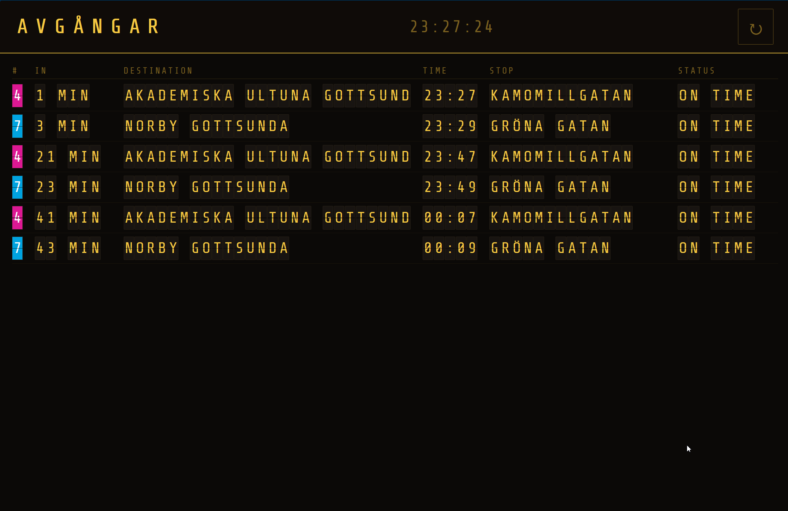
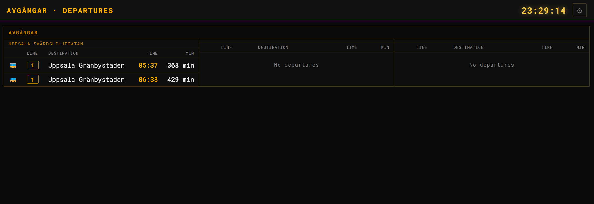
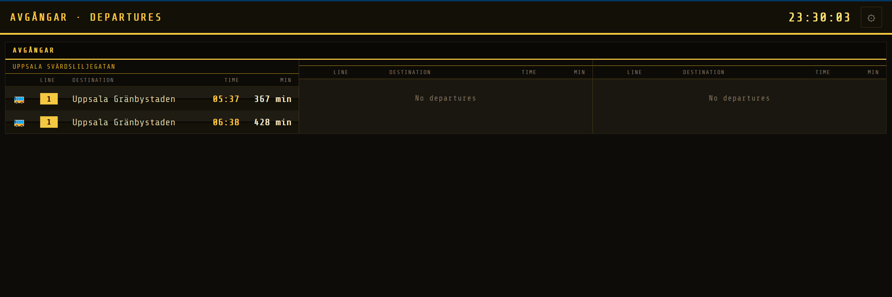
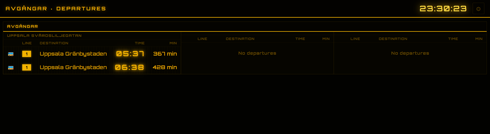
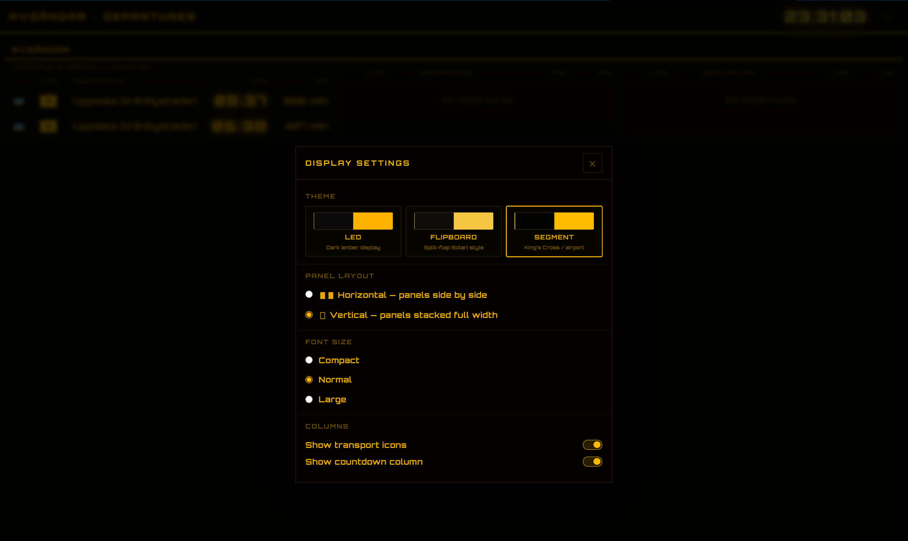

# Bussar
Bus departures via the swedish Trafiklab Realtime API displayed on a web page.

To show this, you need a realtime API key from Trafiklab (free for up to 100 000 requests/month) and a list of the stops you want to display. See config.example.yaml for more configuration, and below for some screenshot examples.

## Screenshots
### Flipboard (/flipper)
This board shows all departures for all stops in the config in an airport-style flipboard layout.

### Theme 1 (/)

### Theme 2 (/)

### Theme 3 (/)

### Settings (/)

